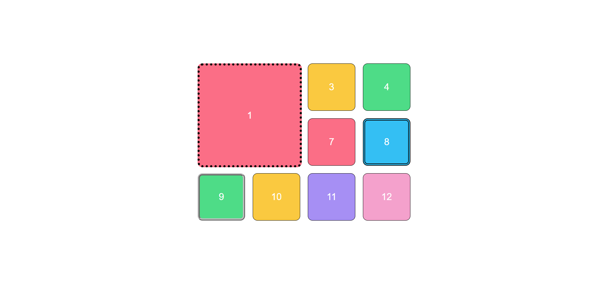
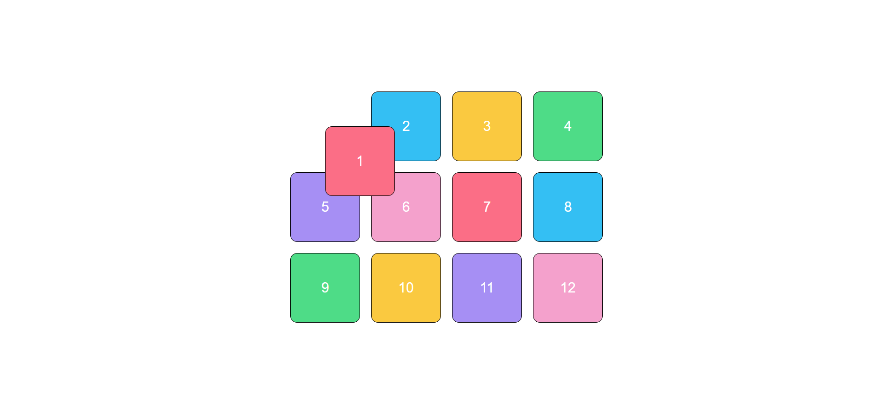
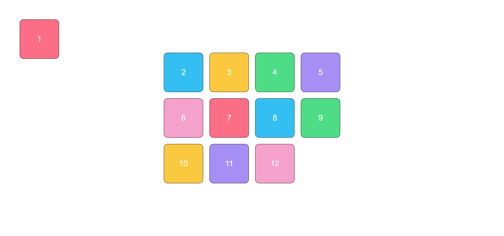

# css-position-task :art: 

Basic Html and css ready.We require you to solve the following tasks.Remember to read the requirements first.

#### Topics you need to know and use to solve tasks

* CSS Box Model
* CSS Positioning Methods

**Final Notes**: *Remember to solve and send assignments on time* :hourglass_flowing_sand:

# Tasks' list 

## Task 1  :star:  :star:  :star:

### Description

 1. First İtem padding 105px,border thickness 5px, dotted and black. 
 2. Item 8 border thickness 5px, double and black. 
 3. Item 9 border thickness 5px, rifge and silver. 

 

## Task 2 :star:  :star:  :star:

### Description

 1. First block should be adjusted away from the top 50px and from the left 50px its position. 

 

 
## Task 3  :star:  :star:  :star:

### Description

 1. When performing the task, uncomment the section in the HTML so that you can do scroll. 
 2. First block should be adjusted away from the top 50px and from the left 50px its position. 
 3. The block should stay fixed when the page is scrolled. 

 